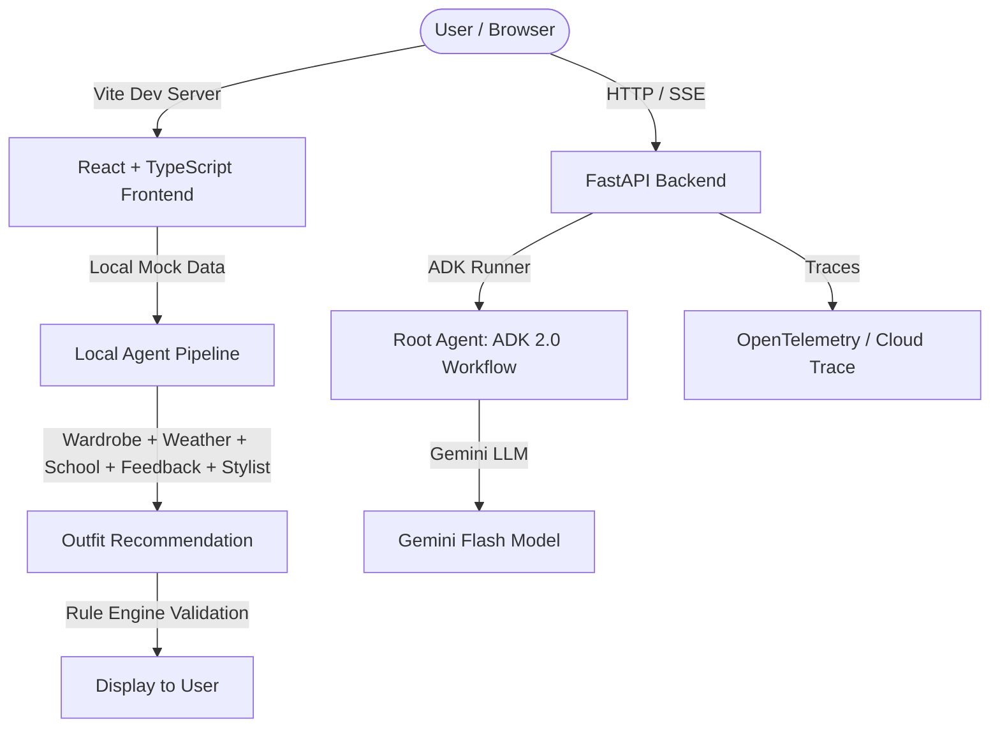
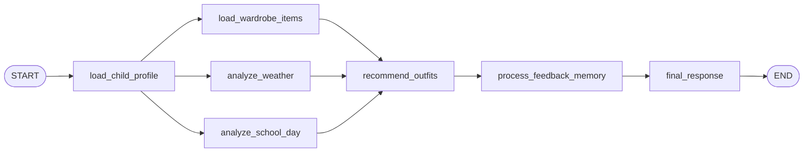
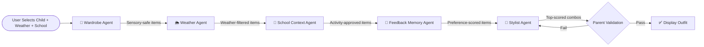

# Smart School Stylist: Project Audit & Architecture Documentation

This document provides a comprehensive audit of the **Smart School Stylist** codebase, reviewing its multi-agent architecture, data schemas, rule engine, frontend implementation, security posture, API readiness, testing coverage, and path to production.

---

## 1. Project Overview

### Purpose of the Project
Choosing clothes for school can be a daily friction point for parents and children. The **Smart School Stylist** is an AI-powered personal stylist assistant designed to solve this by recommending personalized school outfits for children. It analyzes the child's preferences and sensory dislikes, scans their available wardrobe, evaluates the current weather forecast, checks their school schedule (e.g., gym days, art class, field trips, or picture days), and incorporates feedback memory to generate tailored outfit options.

### Current Project Goals
1. **Multi-Agent Orchestration**: Establish a multi-step agent pipeline that automates profile loading, wardrobe filtering, weather/schedule analysis, feedback learning, and recommendation generation.
2. **Strict Rule Enforcement**: Enforce a comprehensive 477-line rule engine covering 4 weather conditions × 5 school activities with parent-validated constraints.
3. **Interactive Frontend Demo**: Provide a premium, fully interactive React + TypeScript frontend that demonstrates the multi-agent architecture with local mock data.
4. **Feedback Learning Loop**: Track parent and child feedback (Like, Dislike, Too Warm, Too Cold) and dynamically influence future outfit recommendations.
5. **Evaluation Setup**: Run local unit, integration, and LLM-as-a-judge evaluations to ensure styling quality.

### Current Implementation Status

#### Backend (Python + ADK 2.0)
- **Core Orchestration**: Structured as a modular multi-agent architecture with a root graph workflow orchestrator in [outfit_workflow.py](file:///c:/Users/Owner/Documents/5-Day%20AI%20Agents/smart-school-stylist/smart-school-stylist/app/workflows/outfit_workflow.py) and a thin entrypoint in [agent.py](file:///c:/Users/Owner/Documents/5-Day%20AI%20Agents/smart-school-stylist/smart-school-stylist/app/agent.py).
- **Separated Agents**: Individual agents (Profile, Wardrobe, Weather, School Context, Stylist, Feedback Memory) reside in their own modules under [app/agents/](file:///c:/Users/Owner/Documents/5-Day%20AI%20Agents/smart-school-stylist/smart-school-stylist/app/agents/).
- **Data Schemas**: Move all structured Pydantic schemas (profiles, wardrobe items, intermediate analyses, outfits, feedback) to the [app/schemas/](file:///c:/Users/Owner/Documents/5-Day%20AI%20Agents/smart-school-stylist/smart-school-stylist/app/schemas/) package.
- **Model & Services**: Gemini model initialization and fallback authentication are isolated in [model_config.py](file:///c:/Users/Owner/Documents/5-Day%20AI%20Agents/smart-school-stylist/smart-school-stylist/app/services/model_config.py).
- **Mock Data**: Wardrobe items and child profiles are separated in the [app/data/](file:///c:/Users/Owner/Documents/5-Day%20AI%20Agents/smart-school-stylist/smart-school-stylist/app/data/) package.
- **FastAPI Wrapper**: Server interface in [fast_api_app.py](file:///c:/Users/Owner/Documents/5-Day%20AI%20Agents/smart-school-stylist/smart-school-stylist/app/fast_api_app.py) with SSE streaming.
- **Telemetry**: OpenTelemetry tracing in [telemetry.py](file:///c:/Users/Owner/Documents/5-Day%20AI%20Agents/smart-school-stylist/smart-school-stylist/app/app_utils/telemetry.py).
- **Tests**: Comprehensive unit and integration tests verify each modular component and the root workflow, all passing successfully.

#### Frontend (React + TypeScript + Vite)
- **Multi-Agent Engine**: 5 sequential agents (Wardrobe → Weather → School Context → Feedback Memory → Stylist) in [outfits.ts](file:///c:/Users/Owner/Documents/5-Day%20AI%20Agents/smart-school-stylist/smart-school-stylist/frontend/src/mock/outfits.ts) (1,261 lines).
- **Rule Engine**: 477-line validation system in [rules.ts](file:///c:/Users/Owner/Documents/5-Day%20AI%20Agents/smart-school-stylist/smart-school-stylist/frontend/src/mock/rules.ts) covering weather, school, structure, sensory, and feedback rules.
- **Main App**: 959-line dashboard component in [App.tsx](file:///c:/Users/Owner/Documents/5-Day%20AI%20Agents/smart-school-stylist/smart-school-stylist/frontend/src/App.tsx) with state management, feedback memory, guided tour, dark mode, and about modal.
- **7 UI Components**: ChildSelector, WeatherCard, SchoolContextCard, OutfitRecommendation, FeedbackSection, WardrobeGallery, DashboardStats.
- **Design System**: 18K+ lines of CSS in [index.css](file:///c:/Users/Owner/Documents/5-Day%20AI%20Agents/smart-school-stylist/smart-school-stylist/frontend/src/index.css) with dark mode, glassmorphism, gradients, and micro-animations.
- **Mock Data**: 30+ wardrobe items per child, 4 weather scenarios, 5 school activities, inline SVG clothing illustrations.

### Main Technologies Used
- **Python (>=3.11, <3.14)**: Backend language.
- **Google ADK (Agent Development Kit) 2.0**: Node orchestration, LLM agents, and session management.
- **Google GenAI SDK**: Interfaces with Google's Gemini models.
- **FastAPI**: Backend REST API host.
- **Pydantic v2**: Data structures and schema definitions.
- **React 19**: Frontend UI framework.
- **TypeScript 6**: Frontend type safety.
- **Vite 8**: Frontend build tool and dev server.
- **Lucide React**: Icon library.
- **Vanilla CSS**: Custom design system with CSS custom properties.
- **Pytest & Pytest-asyncio**: Test runners.
- **OpenTelemetry**: Trace instrumentation.
- **Uvicorn**: ASGI web server.

---

## 2. Architecture Overview

### High-Level Architecture Diagram

### Backend Workflow Diagram (ADK 2.0)

### Frontend Agent Pipeline

### Frontend Request Flow
1. **User Input**: Parent selects child, weather scenario, and school activity.
2. **Wardrobe Agent**: Loads the child's wardrobe and filters out items triggering sensory dislikes.
3. **Weather Agent**: Filters items by temperature and weather condition, determines outerwear, heavy outerwear, and warm accessory requirements.
4. **School Context Agent**: Restricts items based on school activity (PE, Art, Field Trip, Picture Day) — filters shoes, tops, and bottoms by activity-specific rules.
5. **Feedback Memory Agent**: Loads historical feedback (liked colors, liked tags, disliked combos, warmth offset) and computes per-item preference scores.
6. **Stylist Agent**: Assembles all valid outfit combinations (top × bottom × shoes × outerwear × accessory), scores each by style consistency, color harmony, child preferences, and sensory comfort, then sorts by descending score.
7. **Parent Validation Loop**: Iterates through sorted combinations until finding one that passes the 477-line rule engine validation.
8. **Suitability Scoring**: Calculates final suitability score (10–100%) with detailed reasoning notes.
9. **Display**: Renders the outfit with match score, "Why this outfit?" badges, Aura's Focus card, and agent workflow panel.

---

## 3. Agent Inventory

### Backend Agents (ADK 2.0)

| Agent Name | Agent Type | Responsibility | Inputs | Outputs | Dependencies | Status |
| :--- | :--- | :--- | :--- | :--- | :--- | :--- |
| **`smart_school_stylist`** | Root (Workflow) | Orchestrates the node-to-node execution flow | User query string | Formatted markdown text | All sub-agent nodes | Active |
| **`load_child_profile`** | Utility Node | Identifies child name via keyword search; loads child configuration | `types.Content` | `ChildProfile` dict | Local static profiles | Active |
| **`load_wardrobe_items`** | Utility Node | Filters wardrobe database for items belonging to the active child | `ChildProfile` dict | `list[dict]` (WardrobeItems) | Local static wardrobe | Active |
| **`analyze_weather`** | LLM Agent | Extracts weather conditions, temperature, warmth level (1-5), rain gear flag | `{original_query}` | `WeatherAnalysis` JSON | Gemini LLM | Active |
| **`analyze_school_day`** | LLM Agent | Extracts school day schedule constraints, activities, and style guidelines | `{original_query}`, `{child_profile}` | `SchoolDayAnalysis` JSON | Gemini LLM | Active |
| **`recommend_outfits`** | LLM Agent | Selects 3 outfits (Comfort, Style, Weather) from the available wardrobe | `{child_profile}`, `{wardrobe_items}`, `{weather_analysis}`, `{school_day_analysis}` | `OutfitRecommendations` JSON | Gemini LLM | Active |
| **`feedback_memory_agent`** | Utility Node | Processes parent feedback history and stores/logs feedback in context state | `OutfitRecommendations` dict | `OutfitRecommendations` dict | None | Active |
| **`final_response`** | Utility Node | Formats the outfit recommendations into user-facing markdown text | `OutfitRecommendations` dict | Markdown string & SSE Event | None | Active |

### Frontend Agents (TypeScript)

| Agent Name | Function | Responsibility | Input | Output |
| :--- | :--- | :--- | :--- | :--- |
| **Wardrobe Agent** | `runWardrobeAgent()` | Loads child wardrobe, filters sensory-unsafe items | `Child` | Sensory-safe `WardrobeItem[]` |
| **Weather Agent** | `runWeatherAgent()` | Filters items by weather rules, determines outerwear requirements | `WardrobeItem[]`, `WeatherCondition`, `SchoolContext` | Weather-appropriate items + outerwear flags |
| **School Context Agent** | `runSchoolContextAgent()` | Restricts items by school activity rules | `WardrobeItem[]`, `SchoolContext` | Activity-approved items |
| **Feedback Memory Agent** | `runFeedbackMemoryAgent()` | Applies preference scores from feedback history | `WardrobeItem[]`, `ChildFeedbackMemory` | Items + preference scores |
| **Stylist Agent** | `runStylistAgent()` | Assembles, scores, and ranks all valid outfit combinations | All filtered items + preferences | Sorted `OutfitCombination[]` |
| **Rule Engine** | `validateOutfit()` | Post-generation validation against 477 lines of rules | `Outfit`, `Child`, `Weather`, `School` | `ValidationResult` (isValid, severity, reasons, recommendedAction, failedAgents) |

---

## 4. Rule Engine Analysis

The rule engine in [rules.ts](file:///c:/Users/Owner/Documents/5-Day%20AI%20Agents/smart-school-stylist/smart-school-stylist/frontend/src/mock/rules.ts) enforces a strict decision matrix across 5 rule categories:

### 4.1 Dress & Structure Rules (Critical)
- Dresses replace top + bottom — must not be paired with a top shirt
- Non-dress outfits require: top, bottom, and shoes
- Shoes are mandatory for all outfits
- Outerwear on dresses only when weather requires it

### 4.2 Weather Rules (Critical)

| Condition | Tops | Bottoms | Shoes | Outerwear |
| :--- | :--- | :--- | :--- | :--- |
| **☀️ Sunny & Warm** (70°F+) | Short-sleeve only | Shorts/skirts only | Sandals preferred; boots forbidden | Strictly forbidden |
| **💨 Chilly & Windy** (40-70°F) | Long-sleeve preferred | Long pants only | Closed shoes; no sandals/winter boots | Sweatshirt/hoodie mandatory; no heavy coats |
| **🌧️ Rainy & Damp** | Long-sleeve mandatory | Long pants mandatory | Rain boots (or sneakers for PE/Field Trip) | Rain coat/jacket mandatory |
| **❄️ Snowy & Freezing** (<40°F) | Long-sleeve mandatory | Long pants only; no dresses/skirts | Boots or sneakers | Heavy winter coat mandatory; hoodies insufficient |

### 4.3 School Activity Rules (Critical)

| Activity | Shoes | Clothing | Forbidden |
| :--- | :--- | :--- | :--- |
| **🏃 PE / Gym & 🚌 Field Trip** | Running sneakers mandatory | Sporty PE-friendly tops & bottoms | Dresses, skirts, jeans |
| **🎨 Art Class** | Sneakers required | Washable, dark-colored | White clothing, delicate/fancy items |
| **📸 Picture Day** | Ballet flats or sandals | Nice dress or blouse + skirt | Sportswear, sneakers |

### 4.4 Sensory Rules (Critical)
- Checks every outfit item against the child's sensory dislikes
- Tags matching dislikes (e.g., "scratchy tags", "stiff denim") trigger critical violations

### 4.5 Feedback Memory Rules (Warning/Critical)
- Warmth offset: warns if outfit contradicts prior temperature feedback
- Disliked combo check: critical rejection if the exact outfit combo was previously disliked

### 4.6 Parent Validation Summary
- `isValid`: false if any critical violation exists
- `severity`: 'info' | 'warning' | 'critical'
- `reasons`: Up to 3 human-readable validation reasons
- `recommendedAction`: Parent-friendly action text
- `failedAgents`: List of agents responsible for the violations

---

## 5. Frontend Feature Analysis

### 5.1 Interactive Dashboard
- **Child Selector**: Toggle between Emma and Mia with themed avatar colors and gradient backgrounds
- **Weather Card**: 4 weather scenario buttons with icons, temperature ranges, and advisory messages
- **School Context Card**: 5 school activity buttons with day labels, activity descriptions, and special requirements
- **Tab Navigation**: "Today's Outfit" and "Wardrobe Closet" tabs

### 5.2 Outfit Recommendation
- **Outfit Grid**: Visual display of top, bottom, shoes, outerwear, and accessory with SVG illustrations and item details
- **Match Score**: Dynamic percentage badge (10–100%) adjusted by rule validation
- **"Why This Outfit?" Card**: Visual badges (Favorite Colors, Weather Ready, School Ready, Sensory Safe, Great Match) with a concise explanation sentence
- **"Aura's Focus Today" Card**: AI stylist's primary styling theme with icon, title, and 2-line description that updates based on weather, school, and child context
- **Pre-Curated Collections**: 4 themed selectors (Comfort, Weather, Activity, Style) with agent workflow animation on switch

### 5.3 Agent Workflow Visualization
- **Sequential Step Animation**: 6 agent steps animate sequentially (450ms per step) during outfit generation
- **Status Indicators**: Each step shows running (spinner), completed (green checkmark), or highlighted (amber for failed agents) states
- **Agent Names & Icons**: Profile Agent, Wardrobe Agent, Weather Agent, School Agent, Feedback Agent, Stylist Agent
- **Triggered on**: "Generate New Outfit" button, "Generate Updated Outfit" button, and collection type switches

### 5.4 Smart Validation Alerts
- **Green Info Banner**: Displayed when outfit is fully valid — shows compatibility message
- **Orange/Red Alert Panel**: Displayed when validation fails — shows severity badge, up to 3 reasons, recommended action, and "Generate Updated Outfit" button
- **Agent Highlighting**: Failed agents are highlighted in amber in the workflow panel during regeneration

### 5.5 Feedback System
- **4 Feedback Buttons**: Like 👍, Dislike 👎, Too Warm 🔥, Too Cold 🥶
- **Feedback Memory**: Persistent via `localStorage` with per-child tracking
- **Memory Indicators**: Visual chip showing when feedback memory is active
- **Toast Confirmations**: Context-aware messages (e.g., "Aura found a different outfit for Emma")
- **Learning Effects**: Like adds colors/tags to preferences; Dislike blocks specific combos; Temperature adjusts warmth offset

### 5.6 Guided Demo Tour
- **6-Step Walkthrough**: Welcome → Child Profiles → Weather & School → Outfit → Feedback → Wardrobe
- **Auto-Context Switching**: Tour automatically changes weather to "Chilly & Windy" and school to "PE" at step 3, switches to Wardrobe tab at step 6
- **Highlight Overlay**: Active section is highlighted with a pulsing border during each tour step
- **Navigation**: Back, Next, and Finish controls with step indicator badge

### 5.7 Additional Features
- **Dark Mode**: Full theme toggle with CSS custom properties, persists via state
- **About Project Modal**: Tabbed modal ("About" and "Technology") with feature list, AI concepts, demo status, and future enhancements
- **Wardrobe Gallery**: Full closet browser with all items, category filtering, warmth ratings, tags, and sensory details
- **Toast Notifications**: Animated toast system for feedback confirmations, outfit generation events, and collection switches

---

## 6. Data Model Review

### Frontend TypeScript Types (types.ts)

| Type | Purpose | Key Fields |
| :--- | :--- | :--- |
| `Child` | Child identity and styling rules | `name`, `age`, `preferences[]`, `sensoryDislikes[]`, `avatarColor`, `themeGradient` |
| `WeatherCondition` | Weather scenario data | `temp`, `condition`, `icon`, `message`, `high`, `low` |
| `SchoolContext` | School activity context | `day`, `activity`, `specialRequirement`, `icon`, `isPEDay` |
| `WardrobeItem` | Clothing inventory item | `name`, `category`, `color`, `warmRating`, `tags[]`, `isFavorite`, `emoji`, `image`, `fallbackSvg` |
| `Outfit` | Assembled outfit recommendation | `childId`, `top`, `bottom`, `shoes`, `outerwear`, `accessory`, `stylistNotes`, `suitabilityScore` |
| `FeedbackLog` | Feedback event record | `id`, `childId`, `timestamp`, `rating`, `outfitSummary` |
| `ChildFeedbackMemory` | Persistent feedback learning | `likedColors[]`, `likedTags[]`, `dislikedOutfits[]`, `warmthOffset` |

### Backend Pydantic Schemas (agent.py)

| Model | Purpose | Key Fields |
| :--- | :--- | :--- |
| `ChildProfile` | Child identity and preferences | `name`, `age`, `preferences`, `favorite_colors[]`, `dislikes[]` |
| `WardrobeItem` | Clothing item | `id`, `owner`, `category`, `color`, `season`, `warmth_level`, `tags[]` |
| `WeatherAnalysis` | LLM weather extraction | `conditions`, `temperature`, `recommended_warmth`, `requires_rain_gear` |
| `SchoolDayAnalysis` | LLM school extraction | `constraints[]`, `activities[]`, `style_guideline` |
| `Outfit` | Styled outfit combination | `shirt_top`, `bottom_or_dress`, `shoes`, `optional_layer`, `reason` |
| `OutfitRecommendations` | Final recommendation bundle | `best_comfort`, `best_style`, `best_weather` (3 Outfit records) |

---

## 7. Skills Analysis

### Installed Google Agents CLI Skills
- **ADK Skill**: Core library `google-adk[gcp]>=2.0.0` for workflows, LLM agents, and model configuration.
- **Workflow Skill**: Local CLI `playground` and hot-reloading via `agents-cli playground`.
- **Evaluation Skill**: Configured via `google-adk[eval]` with custom LLM-as-a-judge metrics.
- **Testing Skill**: Pytest runner with `pytest-asyncio`.
- **Observability Skill**: OpenTelemetry helper `setup_telemetry()`.

### Active vs. Unused Skills
- **Actively Used**: ADK workflow API, local playground, unit tests, evaluation dataset (20 cases).
- **Available but Unused**: Automated CI/CD evaluation, Cloud Run deployment, GCS observability uploads.

---

## 8. MCP Readiness Assessment

| Tool | Current State | MCP Integration Plan |
| :--- | :--- | :--- |
| **Weather** | Parsed from user input (backend) or selected from mock scenarios (frontend) | `get_weather_forecast(location, date)` → OpenWeatherMap API |
| **Calendar** | Manual school activity selection | `get_school_calendar_events(child_name, date)` → Google Calendar API |
| **Wardrobe** | Hardcoded mock data in TypeScript/Python | `get_child_wardrobe(child_name)` → Database query |
| **Recommendation** | Full local agent pipeline | `rank_wardrobe_items(wardrobe, weather, constraints)` → Hybrid styling algorithms |

---

## 9. Security Review

| Security Area | Current Status | Recommendations |
| :--- | :--- | :--- |
| **Authentication** | None — all routes public | Firebase Authentication JWT middleware |
| **Authorization** | None — any user can access any child | Row-Level Security with `user_id` foreign keys |
| **Data Privacy** | Telemetry logs `NO_CONTENT` only | Maintain PII scrubbing; add consent flows |
| **Child Protection** | Parent-controlled app design | COPPA compliance disclosures |
| **Secrets** | `GEMINI_API_KEY` env var | Google Secret Manager in production |
| **Prompt Injection** | User queries injected into LLM prompts | Input sanitization, XML/JSON wrapping |
| **Frontend Data** | Mock data in TypeScript, feedback in localStorage | Migrate to server-side database with auth |

---

## 10. Testing Review

### Current Coverage
- **Unit Tests** (`tests/unit/test_agent_workflow.py`): 6 tests covering profile parsing, wardrobe filtering, and response formatting.
- **Integration Tests** (`tests/integration/test_agent.py`): Full workflow tests with dress dislike and gym day sneaker constraints.
- **Evaluation Dataset** (`tests/eval/datasets/basic-dataset.json`): 20 scenario-specific test cases.
- **Frontend Build**: Production build (`npm run build`) validates TypeScript compilation and bundle generation.

### Recommended Additions
1. **Frontend Unit Tests**: Jest/Vitest tests for rule engine validation functions.
2. **Cross-Matrix Tests**: Automated tests for all 20 weather × school activity combinations.
3. **Feedback Memory Tests**: Verify that feedback correctly influences subsequent outfit scores.
4. **Visual Regression**: Screenshot tests for key UI states (dark mode, validation alerts, tour).

---

## 11. Competition Readiness Assessment

| Category | Score | Rationale |
| :--- | :---: | :--- |
| **Innovation** | **80 / 100** | Practical app solving a real family problem with a comprehensive rule engine and feedback learning. The frontend demo brings the concept to life with a premium interactive experience. |
| **Agent Design** | **90 / 100** | 5-agent pipeline with strict rule validation, parent-approval loop, feedback memory, and style/color harmony scoring. Both backend (ADK 2.0) and frontend (TypeScript) implementations. |
| **Technical Quality** | **90 / 100** | Modern stack (React 19, TypeScript 6, Vite 8, ADK 2.0). 1,261-line outfit engine, 477-line rule engine, 959-line App component, 18K+ CSS design system. |
| **User Value** | **90 / 100** | High utility with guided tour, real-time validation, feedback memory, dark mode, 4 collections, and wardrobe gallery. Feels like a production app. |
| **Production Readiness** | **65 / 100** | Missing JWT auth, persistent database, real weather API, and container deployment. Frontend demo is production-quality but backend needs cloud infrastructure. |
| **Composite Score** | **83 / 100** | A strong, polished project with a premium frontend demo, comprehensive rule engine, and multi-agent architecture. Key gaps are authentication, database, and external API integration. |

---

## 12. Gap Analysis

| Current State | Missing Components | Priority | Estimated Effort |
| :--- | :--- | :---: | :---: |
| Hardcoded mock wardrobes and profiles | Cloud Firestore with CRUD operations | **High** | 2-3 Days |
| Public API endpoints | Firebase JWT Authentication middleware | **High** | 2 Days |
| Mock weather scenarios | OpenWeatherMap MCP tool integration | **Medium** | 2 Days |
| Manual school activity selection | Google Calendar MCP tool integration | **Medium** | 3 Days |
| Text-only wardrobe items | GCS Image Storage + Gemini Vision auto-tagging | **Medium** | 3 Days |
| localStorage feedback memory | Cloud-based persistent feedback with trend analysis | **Medium** | 2 Days |
| Frontend-only interactive demo | Connected frontend ↔ backend with SSE streaming | **High** | 3-4 Days |

---

## 13. Development Roadmap

### Phase 1: Competition-Ready Project ✅ (Completed)
1. ✅ Fix all backend test bugs and add robust type safety
2. ✅ Build premium React + TypeScript frontend with multi-agent pipeline
3. ✅ Implement 477-line rule engine with weather × school activity matrix
4. ✅ Add feedback memory system with localStorage persistence
5. ✅ Create 4 pre-curated outfit collections
6. ✅ Build guided demo tour with 6 interactive steps
7. ✅ Implement agent workflow visualization with sequential animation
8. ✅ Add smart validation alerts with one-click regeneration
9. ✅ Design dark mode with full CSS custom properties system
10. ✅ Add about project modal with tabbed views
11. ✅ Expand evaluation dataset to 20 scenario-specific test cases

### Phase 2: Production-Ready Backend (2-3 Weeks)
1. **Database & API Integration**: Set up Cloud Firestore, refactor workflow nodes, implement REST routes.
2. **Security**: Add Firebase Auth JWT verification middleware and data ownership validations.
3. **MCP Tool Integrations**: Replace mock weather/schedule with external API calls.
4. **Frontend-Backend Connection**: Connect React frontend to FastAPI backend with SSE streaming.
5. **Deploy**: Containerize and deploy to Google Cloud Run with Secret Manager.

### Phase 3: Production-Ready Mobile Application (3-4 Weeks)
1. **Mobile App**: Bootstrap React Native / Expo with parent dashboard and outfit selection screens.
2. **Smart Wardrobe Scanner**: Camera interface → GCS upload → Gemini Vision auto-classification.
3. **Interactive Recommendations**: Three-tab outfit display (Comfort, Style, Weather) with saved history.
4. **Long-Term Learning**: Cloud-based feedback memory with trend analysis and seasonal adaptation.
