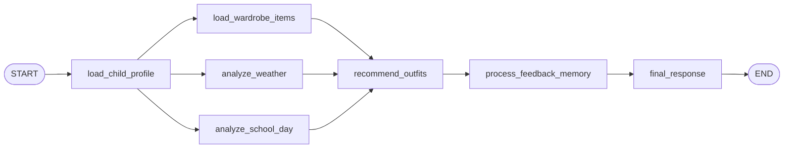
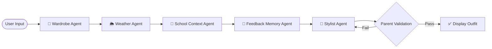

# Smart School Stylist 👗🎒

An AI-powered concierge agent that helps parents and children choose school outfits based on weather, schedule, and personal preferences — reducing morning friction and keeping kids comfortable, confident, and appropriately dressed every day.

## Competition Track: Concierge Agents

Smart School Stylist is built under the **Concierge Agents** track for the **Google 5-Day AI Agents: Intensive Vibe Coding Course**. It serves as a personal styling concierge that handles the daily decision-making process of selecting outfits, factoring in multiple complex rules (weather suitability, school schedules like gym or picture days, sensory preferences, feedback memory, and color/style coordination).

---

## ✨ Live Demo Features

The project includes a **fully interactive React + TypeScript frontend** that demonstrates the multi-agent architecture with local mock data — no API keys or backend required.

### 🎯 Core Features

| Feature | Description |
| :--- | :--- |
| **Multi-Agent Outfit Engine** | 5 specialized agents (Wardrobe, Weather, School Context, Feedback Memory, Stylist) collaborate to generate context-aware outfit recommendations |
| **Smart Rule Engine** | 477-line rule validation system with strict weather rules (Sunny & Warm, Chilly & Windy, Rainy & Damp, Snowy & Freezing) and school activity rules (PE/Gym, Art Class, Field Trip, Picture Day) |
| **Experienced Parent Validation** | Every generated outfit passes a "Would a real parent send their child in this?" validation check before display |
| **Feedback Memory System** | Persistent localStorage-based memory that tracks Likes, Dislikes, Too Warm, and Too Cold feedback to influence future recommendations |
| **Pre-Curated Collections** | 4 themed outfit collections: Sensory Comfort First, Weather Protection Shield, School Event Approved, and Signature Style & Color |
| **Real-Time Validation Alerts** | Smart alerts when weather/school changes make the current outfit invalid, with one-click regeneration |
| **Guided Walkthrough Tour** | 6-step interactive demo tour that showcases all features with context auto-switching |
| **Dark Mode** | Full light/dark theme toggle |
| **About Project Modal** | Premium tabbed modal with "About" and "Technology" views |

### 👧 Child Profiles

- **Emma** (age 11): Loves unicorns, pastel pink & purple, flowy skirts, cute accessories, graphic tees. Sensory dislikes: scratchy tags, stiff denim, itchy wool, rough seams.
- **Mia** (age 7): Loves sporty styles, bright blue & teal, comfortable shorts, soccer theme, activewear. Sensory dislikes: tight collars, squeezing waistbands, heavy fabrics, restrictive jackets.

### 🌦️ Weather Scenarios

| Scenario | Temp | Rules |
| :--- | :--- | :--- |
| ☀️ Sunny & Warm | 74°F | Short sleeves, shorts/skirts only, sandals preferred, outerwear forbidden |
| 💨 Chilly & Windy | 52°F | Long sleeves, long pants, hoodie/sweatshirt mandatory, closed shoes |
| 🌧️ Rainy & Damp | 58°F | Rain coat mandatory, long sleeves, rain boots (or sneakers for PE) |
| ❄️ Snowy & Freezing | 28°F | Heavy winter coat, long sleeves, long pants, boots/sneakers, scarf recommended |

### 🏫 School Activities

| Activity | Key Rules |
| :--- | :--- |
| 🏫 Regular Day | Standard comfortable school wear |
| 🏃 PE / Gym Day | Sneakers mandatory, sporty PE-friendly clothing, no jeans/dresses/skirts |
| 🎨 Art Class | No white clothing, no delicate/fancy items, sneakers required |
| 🚌 Field Trip | Sneakers mandatory, active PE-friendly clothing, no jeans/dresses |
| 📸 Picture Day | Nice dress or blouse + skirt, ballet flats/sandals, no sportswear/sneakers |

---

## Architecture Overview

The system is designed around a multi-agent Directed Acyclic Graph (DAG) orchestration pattern. The **backend** uses **Google ADK 2.0** with a FastAPI wrapper and Gemini LLM agents. The **frontend** implements the same multi-agent architecture pattern locally with TypeScript, using mock data for a fully self-contained demo.

### Backend Agent Flow (ADK 2.0)



### Frontend Agent Pipeline (Local TypeScript)



#### Frontend Agent Descriptions

| Agent | Responsibility |
| :--- | :--- |
| **Wardrobe Agent** | Loads the child's wardrobe and filters out sensory-unsafe items |
| **Weather Agent** | Filters items by temperature/condition, determines outerwear and accessory requirements |
| **School Context Agent** | Restricts items by school activity rules (PE, Art, Picture Day, Field Trip) |
| **Feedback Memory Agent** | Applies preference scores from historical Like/Dislike/Temperature feedback |
| **Stylist Agent** | Assembles, scores, and ranks all valid outfit combinations using style consistency, color harmony, and child-specific preferences |
| **Rule Engine Validator** | Post-generation validation with 477 lines of strict weather, school, structure, and sensory rules |

---

## Agent Inventory (Backend)

| Node Name | Node Type | Responsibility | External Services |
| :--- | :--- | :--- | :--- |
| **`load_child_profile`** | Utility | Parses user query to select and load child profile | None |
| **`load_wardrobe_items`** | Utility | Filters wardrobe items for the selected child | None |
| **`analyze_weather`** | LLM Agent | Extracts weather conditions, temperature, warmth level | Gemini LLM |
| **`analyze_school_day`** | LLM Agent | Identifies school activities and styling constraints | Gemini LLM |
| **`recommend_outfits`** | LLM Agent | Selects 3 outfits (Comfort, Style, Weather) from wardrobe | Gemini LLM |
| **`feedback_memory_agent`** | Utility | Processes parent feedback history and stores/logs feedback in context state | None |
| **`final_response`** | Utility | Formats recommendations as user-facing Markdown | None |

---

## Project Structure

```
smart-school-stylist/
├── app/                              # Backend: ADK 2.0 agent code
│   ├── agents/                       # Individual specialized agent nodes
│   │   ├── __init__.py
│   │   ├── profile_agent.py          # Loads profiles and detects child names
│   │   ├── wardrobe_agent.py         # Filters and loads available wardrobe
│   │   ├── weather_agent.py          # Analyzes weather conditions using LLM
│   │   ├── school_context_agent.py   # Extracts school activity constraints using LLM
│   │   ├── stylist_agent.py          # Generates outfit recommendations using LLM
│   │   └── feedback_memory_agent.py  # Tracks and processes parent feedback
│   ├── data/                         # Mock data files
│   │   ├── __init__.py
│   │   ├── mock_profiles.py          # Static child profiles (Emma & Mia)
│   │   └── mock_wardrobe.py          # 30+ clothing items with attributes and tags
│   ├── schemas/                      # Pydantic data models
│   │   ├── __init__.py
│   │   ├── child_profile.py
│   │   ├── wardrobe_item.py
│   │   ├── weather_analysis.py
│   │   ├── school_day_analysis.py
│   │   ├── outfit.py
│   │   └── feedback.py
│   ├── services/                     # Model and authentication services
│   │   ├── __init__.py
│   │   └── model_config.py           # Gemini model initialization and fallback auth
│   ├── workflows/                    # Graph orchestration pipelines
│   │   ├── __init__.py
│   │   └── outfit_workflow.py        # Defines the root Workflow and graph edges
│   ├── agent.py                      # Thin entrypoint delegating to workflows
│   ├── fast_api_app.py               # FastAPI server wrapper (SSE streaming)
│   └── app_utils/                    # Telemetry & helper utilities
├── frontend/                         # Frontend: React + TypeScript + Vite
│   ├── src/
│   │   ├── App.tsx                   # Main dashboard (959 lines)
│   │   ├── App.css                   # App-level styles
│   │   ├── index.css                 # Design system & global styles (dark mode)
│   │   ├── types.ts                  # TypeScript type definitions
│   │   ├── components/
│   │   │   ├── ChildSelector.tsx     # Child profile picker
│   │   │   ├── WeatherCard.tsx       # Weather scenario selector
│   │   │   ├── SchoolContextCard.tsx # School activity selector
│   │   │   ├── OutfitRecommendation.tsx  # Outfit display, badges, agent workflow
│   │   │   ├── FeedbackSection.tsx   # Like/Dislike/Temperature feedback buttons
│   │   │   ├── WardrobeGallery.tsx   # Full wardrobe browser
│   │   │   └── DashboardStats.tsx    # Dashboard statistics
│   │   └── mock/
│   │       ├── children.ts           # Mock child profiles (Emma & Mia)
│   │       ├── wardrobe.ts           # 30+ wardrobe items per child with tags
│   │       ├── weather.ts            # 4 weather scenarios
│   │       ├── school.ts             # 5 school activity scenarios
│   │       ├── outfits.ts            # Multi-agent outfit generation engine (1261 lines)
│   │       ├── rules.ts             # Rule engine & validation (477 lines)
│   │       └── svgAssets.ts          # Inline SVG clothing illustrations
│   ├── index.html                    # Entry HTML with SEO meta tags
│   └── package.json                  # React 19, Vite 8, TypeScript 6
├── tests/                            # Unit, integration, and evaluation tests
│   ├── unit/                         # Unit tests for agent workflow
│   ├── integration/                  # Full workflow integration tests
│   └── eval/                         # LLM evaluation dataset (20 cases)
├── GEMINI.md                         # AI-assisted development guide
├── SECURITY.md                       # Security & privacy policy
├── PROJECT_DOCUMENTATION.md          # Full architecture & audit documentation
├── Dockerfile                        # Container configuration
├── pyproject.toml                    # Python dependencies (ADK, FastAPI, etc.)
└── agents-cli-manifest.yaml          # Google Agents CLI configuration
```

> 💡 **Tip:** Use [Gemini CLI](https://github.com/google-gemini/gemini-cli) for AI-assisted development — project context is pre-configured in `GEMINI.md`.

---

## How to Run

### Frontend (Interactive Demo — No API Key Required)

```bash
cd frontend
npm install
npm run dev
```

Open [http://localhost:5173](http://localhost:5173) to use the interactive demo.

### Backend (ADK Agent — Requires Gemini API Key)

#### Prerequisites
- Python 3.11+
- [uv](https://docs.astral.sh/uv/) (Python package manager)
- [google-agents-cli](https://github.com/google-gemini/agents-cli)
- **Google Cloud SDK** (optional): For GCP services — [Install](https://cloud.google.com/sdk/docs/install)

#### Setup
1. Clone the repository and navigate to the project directory:
   ```bash
   cd smart-school-stylist
   ```
2. Install dependencies:
   ```bash
   uv tool install google-agents-cli
   agents-cli install
   ```
3. Set your Gemini API key:
   - On Windows (PowerShell):
     ```powershell
     $env:GEMINI_API_KEY="your_api_key_here"
     ```
   - On Linux/macOS:
     ```bash
     export GEMINI_API_KEY="your_api_key_here"
     ```

#### Running the Backend
- Launch the interactive local development playground:
  ```bash
  agents-cli playground
  ```
- Alternatively, run the FastAPI web server:
  ```bash
  uv run uvicorn app.fast_api_app:app --host 127.0.0.1 --port 8000 --reload
  ```

---

## Demo Prompts (Backend)

- "Recommend a school outfit for Emma. It's a sunny day and she has PE class."
- "Mia has art class on a chilly day. What should she wear?"
- "It's cold and rainy today, and Emma has picture day. Help her choose an outfit."

---

## Commands Reference

| Command | Description |
| :--- | :--- |
| `npm run dev` | Start the frontend development server (Vite) |
| `npm run build` | Build the frontend for production |
| `agents-cli install` | Install backend dependencies using uv |
| `agents-cli playground` | Launch the backend local development environment |
| `agents-cli lint` | Run code quality checks |
| `agents-cli eval` | Evaluate agent behavior (see `agents-cli eval --help`) |
| `uv run pytest tests` | Run the test suite (unit and integration tests) |

### 🛠️ Project Management

| Command | What It Does |
| :--- | :--- |
| `agents-cli scaffold enhance` | Add CI/CD pipelines and Terraform infrastructure |
| `agents-cli infra cicd` | One-command setup of entire CI/CD pipeline + infrastructure |
| `agents-cli scaffold upgrade` | Auto-upgrade to latest version while preserving customizations |

---

## Deployment & Production

```bash
gcloud config set project <your-project-id>
agents-cli deploy
```

To add CI/CD and Terraform, run `agents-cli scaffold enhance`.
To set up your production infrastructure, run `agents-cli infra cicd`.

### Observability
Built-in telemetry exports to Cloud Trace, BigQuery, and Cloud Logging.

---

## Technology Stack

### Frontend
- **React 19** + **TypeScript 6** + **Vite 8**
- **Vanilla CSS** with custom design system (glassmorphism, gradients, dark mode)
- **Lucide React** for icons
- **localStorage** for persistent feedback memory

### Backend
- **Python 3.11+** with **Google ADK 2.0**
- **Google GenAI SDK** (Gemini models)
- **FastAPI** + **Uvicorn** (ASGI server)
- **Pydantic v2** for data validation
- **OpenTelemetry** for tracing
- **Pytest** + **Pytest-asyncio** for testing

---

## Current Implementation Status

- ✅ **ADK 2.0 Graph Workflow**: Multi-agent chain with Pydantic schema validation
- ✅ **React Frontend**: Premium interactive demo with 7 components, 959-line App, and 18K+ lines of CSS
- ✅ **Multi-Agent Engine**: 5 sequential agents (Wardrobe → Weather → School → Feedback → Stylist)
- ✅ **Rule Engine**: 477-line validation system covering 4 weather conditions × 5 school activities
- ✅ **Feedback Memory**: Persistent learning from Like/Dislike/Temperature feedback via localStorage
- ✅ **Pre-Curated Collections**: 4 themed outfit collection types
- ✅ **Parent Validation Loop**: Outfits are validated against strict parent-approval rules before display
- ✅ **Smart Alerts**: Real-time validation alerts with one-click outfit regeneration
- ✅ **Agent Workflow Visualization**: Sequential agent step animation with status indicators
- ✅ **Guided Demo Tour**: 6-step interactive walkthrough with auto-context switching
- ✅ **Dark Mode**: Full theme toggle with CSS custom properties
- ✅ **About Modal**: Premium tabbed modal showcasing project goals and AI concepts
- ✅ **Toast Notifications**: Context-aware toast messages for feedback and generation events
- ✅ **Wardrobe Gallery**: Full closet browser with category filtering and sensory safety tags
- ✅ **20 Evaluation Cases**: Expanded evaluation dataset for offline quality checks
- ✅ **Structured Observability**: Logging in every workflow node without PII exposure

---

## Future Roadmap

1. **Database Integration**: Migrate mock wardrobes and child profiles to **Google Cloud Firestore**
2. **User Authentication**: Implement **Firebase Authentication** JWT middleware in FastAPI
3. **MCP Tool Services**: Build MCP servers for OpenWeatherMap and Google Calendar
4. **Smart Wardrobe Scanner**: GCS upload + Gemini Vision agent to auto-classify clothing photos
5. **Mobile Application**: Build a **React Native / Expo** mobile client
6. **Long-Term Learning**: Persistent cloud-based feedback memory with trend analysis
