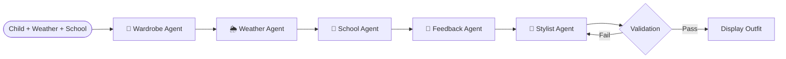

# Smart School Stylist — Frontend 👗✨

An interactive React + TypeScript demo of the **Smart School Stylist** multi-agent AI wardrobe planner. This frontend implements the full agent pipeline locally using mock data — **no API keys, no backend, no external services required**.

---

## Quick Start

```bash
npm install
npm run dev
```

Open [http://localhost:5173](http://localhost:5173) to launch the demo.

### Build for Production

```bash
npm run build
npm run preview
```

---

## Technology Stack

| Technology | Version | Purpose |
| :--- | :--- | :--- |
| **React** | 19.2 | UI framework |
| **TypeScript** | 6.0 | Type safety |
| **Vite** | 8.1 | Build tool & dev server |
| **Lucide React** | 1.21 | Icon library |
| **Vanilla CSS** | — | Custom design system with dark mode, glassmorphism, gradients |

---

## Architecture

The frontend implements a **5-agent pipeline** that mirrors the backend ADK 2.0 architecture, running entirely in the browser:



### Agent Pipeline

| # | Agent | File | Responsibility |
| :--- | :--- | :--- | :--- |
| 1 | **Wardrobe Agent** | `mock/outfits.ts` | Loads wardrobe, filters sensory-unsafe items |
| 2 | **Weather Agent** | `mock/outfits.ts` | Filters by temperature/condition, determines outerwear needs |
| 3 | **School Context Agent** | `mock/outfits.ts` | Restricts items by school activity rules |
| 4 | **Feedback Memory Agent** | `mock/outfits.ts` | Applies preference scores from historical feedback |
| 5 | **Stylist Agent** | `mock/outfits.ts` | Ranks combinations by style, color harmony, and preferences |
| — | **Rule Engine** | `mock/rules.ts` | Post-generation validation (477 lines of rules) |

---

## Features

### 🎯 Core
- **Dynamic Outfit Generation** — Multi-agent pipeline produces context-aware recommendations
- **Real-Time Validation** — Rule engine validates every outfit against weather, school, and sensory rules
- **Experienced Parent Validation** — "Would a real parent send their child in this?" check
- **Pre-Curated Collections** — 4 themed outfit types: Comfort, Weather, Activity, Style

### 👧 Child Profiles
- 2 children: **Emma** (11, creative/elegant) and **Mia** (7, sporty/active)
- Unique preferences, favorite colors, and strict sensory dislikes per child
- Wardrobe of 30+ items per child with detailed tags, warmth ratings, and SVG illustrations

### 🌦️ Weather & School
- 4 weather scenarios: Sunny & Warm, Chilly & Windy, Rainy & Damp, Snowy & Freezing
- 5 school activities: Regular Day, PE/Gym, Art Class, Field Trip, Picture Day
- Strict cross-matrix rules (e.g., PE + Rainy = sneakers + rain coat, Picture Day = dress + flats)

### 💬 Feedback Loop
- Like / Dislike / Too Warm / Too Cold buttons
- Persistent feedback memory via `localStorage`
- Memory influences future outfit scoring (colors, tags, warmth offset, disliked combos)
- Visual memory indicators and context-aware toast confirmations

### 🎨 UI/UX
- **Premium design** with glassmorphism, gradients, and micro-animations
- **Dark mode** with full theme toggle
- **Guided Demo Tour** — 6-step walkthrough with auto-context switching
- **Agent Workflow Panel** — Visual agent step progression with status indicators
- **Smart Alert System** — Validation warnings with one-click outfit regeneration
- **Toast Notifications** — Contextual feedback confirmations
- **About Project Modal** — Tabbed "About" and "Technology" views
- **Wardrobe Gallery** — Full closet browser with category filtering

---

## File Structure

```
frontend/src/
├── App.tsx                    # Main dashboard component (959 lines)
├── App.css                    # App-level styles
├── index.css                  # Design system & global styles (18K+ lines)
├── main.tsx                   # React entry point
├── types.ts                   # TypeScript interfaces (Child, Outfit, Weather, etc.)
├── components/
│   ├── ChildSelector.tsx      # Child profile selector with avatar themes
│   ├── WeatherCard.tsx        # Weather scenario picker with icons & messages
│   ├── SchoolContextCard.tsx  # School activity selector with requirements
│   ├── OutfitRecommendation.tsx  # Outfit grid, badges, match score, Aura focus card
│   ├── FeedbackSection.tsx    # Feedback buttons with memory indicators
│   ├── WardrobeGallery.tsx    # Full wardrobe browser with filtering
│   └── DashboardStats.tsx     # Dashboard statistics component
└── mock/
    ├── children.ts            # 2 child profiles with preferences & sensory dislikes
    ├── wardrobe.ts            # 30+ items per child with tags, warmth, SVG assets
    ├── weather.ts             # 4 weather conditions with temperatures & messages
    ├── school.ts              # 5 school activities with requirements & icons
    ├── outfits.ts             # Multi-agent outfit generation engine (1261 lines)
    ├── rules.ts               # Rule engine validation system (477 lines)
    └── svgAssets.ts           # Inline SVG clothing illustrations (19K)
```

---

## Rule Engine Overview

The rule engine in `mock/rules.ts` validates every outfit against a strict decision matrix:

### Weather Rules (Mandatory)
| Condition | Clothing | Shoes | Outerwear |
| :--- | :--- | :--- | :--- |
| ☀️ Sunny & Warm (70°F+) | Short sleeves, shorts/skirts only | Sandals preferred, boots forbidden | Strictly forbidden |
| 💨 Chilly & Windy (40-70°F) | Long sleeves, long pants | Closed shoes, no sandals/boots | Sweatshirt/hoodie mandatory |
| 🌧️ Rainy & Damp | Long sleeves, long pants | Rain boots (or sneakers for PE) | Rain coat mandatory |
| ❄️ Snowy & Freezing (<40°F) | Long sleeves, long pants | Boots or sneakers | Heavy winter coat mandatory |

### School Activity Rules (Mandatory)
| Activity | Key Constraints |
| :--- | :--- |
| 🏃 PE / Gym | Sneakers, PE-friendly clothing, no jeans/dresses/skirts |
| 🎨 Art Class | No white, no delicate items, sneakers required |
| 🚌 Field Trip | Same as PE rules |
| 📸 Picture Day | Dress or blouse+skirt, flats/sandals, no sportswear |

### Additional Rules
- **Dress structure**: Dresses replace top+bottom, must not be paired with a top
- **Sensory safety**: Items triggering child dislikes are critical violations
- **Feedback memory**: Previously disliked combos are rejected; warmth preferences applied
- **Parent validation**: Overall "experienced parent" approval check

---

## Development

### Available Scripts

| Script | Description |
| :--- | :--- |
| `npm run dev` | Start development server with HMR |
| `npm run build` | TypeScript check + Vite production build |
| `npm run lint` | Run Oxlint code quality checks |
| `npm run preview` | Preview the production build locally |

### Expanding the Oxlint Configuration

For type-aware lint rules, install `oxlint-tsgolint` and update `.oxlintrc.json`:

```json
{
  "$schema": "./node_modules/oxlint/configuration_schema.json",
  "plugins": ["react", "typescript", "oxc"],
  "options": {
    "typeAware": true
  },
  "rules": {
    "react/rules-of-hooks": "error",
    "react/only-export-components": ["warn", { "allowConstantExport": true }]
  }
}
```

See the [Oxlint rules documentation](https://oxc.rs/docs/guide/usage/linter/rules) for the full list.

---

## Demo Mode

This frontend runs entirely on **local mock data**:
- ✅ No external APIs
- ✅ No Gemini API key required
- ✅ No backend server needed
- ✅ Feedback memory persisted in localStorage
- ✅ All agent logic runs in the browser
